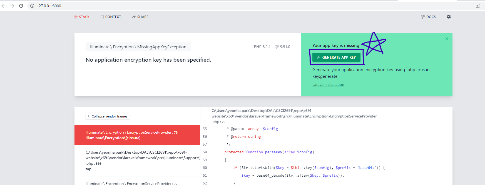
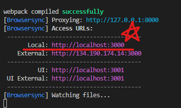

# x691 Website


## Dev Environment Setup
***

The following list of things must be installed:
1. XAMPP with PHP version higher than 8. It's important that you have PHP version higher than 8!
2. [Composer](https://getcomposer.org/)
3. [Laravel](https://laravel.com/docs/9.x#your-first-laravel-project) globally using the command:
    ``` composer global require laravel/installer ```
4. Node and NPM

</br>
</br>

## LOCALLY Running the Project First Time Procedures
***
1. [Folder Level: x691] Make sure to install all npm dependecies by running ``` npm install  ```
2. [Folder Level: x691] Install all composer packages by running ``` composer install ```
3. [Folder Level: x691] Create an empty .env file in the project root folder. Copy paste the content of .env.exmaple to the .env file.
4. [Folder Level: x691] Run ``` php artisan serve ```
5. Open localhost:8000 
6. Click on "GENERATE API KEY
    
7. Refresh the page.

</br>
</br>

## Git Setup 
***
To make a new branch make sure to branch off of the development branch instead of main. 
```
git checkout -b ＜new-branch＞ ＜existing-branch＞
```

</br>
</br>

## Regular Build Procedures
***

To see changes live updates without reloading the page run the following commands in steps

1. Open up a cmd line then run:
    ```
    npm run serve 
    ```

2. Open up another cmd line then run:
    ``` 
    npm run mix 
    ```

2. Open up the url that shows in Access URLs > Local in the cmd line that you run npm run mix in step 2. 

    

